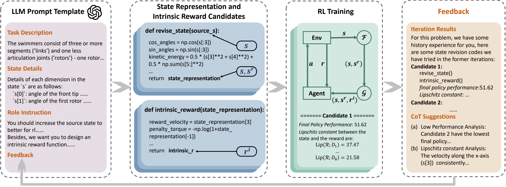
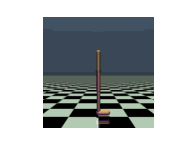
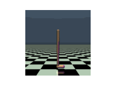

# LLM-Empowered State Representation for Reinforcement Learning

<div align="center">
<!--  -->

</div>
<br>
Conventional state representations in reinforcement learning often omit critical task-related details, presenting a significant challenge for value networks in establishing accurate mappings from states to task rewards. Traditional methods typically depend on extensive sample learning to enrich state representations with task-specific information, which leads to low sample efficiency and high time costs. Recently, surging knowledgeable large language models (LLMs) have provided promising substitutes for prior injection with minimal human intervention. Motivated by this, we propose LLM-Empowered State Representation (LESR), a novel approach that utilizes LLM to autonomously generate task-related state representation codes which help to enhance the continuity of network mappings and facilitate efficient training. Experimental results demonstrate LESR exhibits high sample efficiency and outperforms state-of-the-art baselines by an average of 29% in accumulated reward in Mujoco tasks and 30% in success rates in Gym-Robotics tasks. 

# Installation
1. Create a new conda environment with:
    ```
    conda create -n lesr python=3.8
    conda activate lesr
    ```
2. Install the packages in the requirements.txt:
    ```
    pip install -r requirements.txt
    ```
3. Install Mujoco from [here](https://mujoco.org) (LESR tested with Mujoco 210).
4. LESR also uses OpenAI API for large language model queries. You need to have an OpenAI API account ([here](https://platform.openai.com/account/api-keys)) to run LESR . 

# Getting Started

Navigate to the `LESR` directory and execute the command within a tmux session:
```
python lesr_main.py --env HalfCheetah-v4  --intrinsic_w 0.02 --sample_count 6 --iteration 3 --model gpt-4-1106-preview --cuda 0 --temperature 0.0 --max_timesteps 800000 --max_evaluate_timesteps 1000000 --openai_key your-openai-key
```
- `{intrinsic_w}` is the intrinsic reward weight $w$.
- `{sample_count}` is the sample count $K$ during each iteration.
- `{iteration}` is the total iteration count $I$.
- `{max_timesteps}` is the training steps $N_{small}$ for each training during iterations.
- `{max_evaluate_timesteps}` is the final training steps $N$.

# Results of LESR
The optimal state representation and intrinsic reward functions, denoted as $\mathcal{F}_{best}$ and $\mathcal{G}_{best}$, are accessible in the following directory:
```
./LESR-resources/LESR-best-result
```

## Results of two novel tasks

**Two New Task Decriptions**: To further validate the generalization capability of LESR, we conduct experiments on two entirely new task descriptions: 

1. **Walker Jump**: requiring the walker agent to learn to jump in place, and 
2. **Walker Split Legs**: requiring the walker agent to learn to stand with its legs apart. 

We abstain from any iterations or feedback, training solely on the $\mathcal{F}, \mathcal{G}$ produced in the first round of LESR, and only for 300k time steps. We generate the final GIFs as follows. It is observed that the walker can perform the jumping and standing with legs apart actions as per the task descriptions.   

<div align="center">
    <figure style="display:inline-block; margin-right:20px;">
        
        <figcaption>The 'Walker Jump' task</figcaption>
    </figure>
    <figure style="display:inline-block;">
        
        <figcaption>The 'Walker Split Legs' task</figcaption>
    </figure>
</div>

Here we provide the state representation and intrinsic reward function codes $\mathcal{F}, \mathcal{G}$ of the two tasks:

$\mathcal{F}, \mathcal{G}$ of **Walker Jump** : 
```
import numpy as np

def revise_state(s):
    # Original state dimensions
    z_torso = s[0]
    angles = s[1:8]  # All joint angles
    velocities = s[8:17]  # All velocities
    
    # Calculate the center of mass (CoM) in the z-direction (simplified)
    # Assuming uniform mass distribution and equal length of body parts
    # This is a placeholder for a more accurate CoM calculation
    com_z = z_torso  # Simplified, as we don't have lengths and masses
    
    # Calculate potential energy (PE) assuming a uniform gravitational field
    # PE = m * g * h, where m is mass, g is gravitational acceleration, and h is height
    # We assume a unit mass for simplicity
    g = 9.81  # Gravitational acceleration (m/s^2)
    potential_energy = com_z * g
    
    # Calculate kinetic energy (KE) of the torso
    # KE = 0.5 * m * v^2, where m is mass and v is velocity
    # We assume a unit mass for simplicity
    kinetic_energy = 0.5 * (velocities[0]**2 + velocities[1]**2)
    
    # Calculate a stability measure based on the torso angle
    # A smaller angle indicates better stability
    stability_measure = np.exp(-np.abs(s[1]))
    
    # Concatenate the new features to the original state vector
    updated_s = np.concatenate((s, [com_z, potential_energy, kinetic_energy, stability_measure]))
    
    return updated_s

def intrinsic_reward(updated_s):
    # Define weights for different components of the intrinsic reward
    weight_potential_energy = 1.0
    weight_kinetic_energy = 0.5
    weight_stability = 2.0
    
    # Extract the additional features from the updated state
    potential_energy = updated_s[17]
    kinetic_energy = updated_s[18]
    stability_measure = updated_s[19]
    
    # Calculate the intrinsic reward as a weighted sum of the additional features
    intrinsic_reward = (weight_potential_energy * potential_energy +
                        weight_kinetic_energy * kinetic_energy +
                        weight_stability * stability_measure)
    
    return intrinsic_reward
```

$\mathcal{F}, \mathcal{G}$ of **Walker Split Legs** : 
```
import numpy as np

def revise_state(s):
    # Calculate the distance between the feet
    # Assuming that s[5] and s[6] represent the angles of the left and right thighs respectively,
    # and s[7] and s[8] represent the angles of the left and right legs respectively.
    # We will use a simple geometric calculation to estimate the distance between the feet.
    # This is a simplification and would need to be adjusted for a real-world scenario.
    thigh_length = 0.5  # Hypothetical length of the thigh, adjust as necessary
    leg_length = 0.5    # Hypothetical length of the leg, adjust as necessary
    left_foot_x = thigh_length * np.sin(s[5]) + leg_length * np.sin(s[5] + s[6])
    right_foot_x = thigh_length * np.sin(s[2]) + leg_length * np.sin(s[2] + s[3])
    feet_distance = np.abs(left_foot_x - right_foot_x)
    
    # Calculate the stability metric (e.g., the vertical alignment of the torso)
    # A simple metric might be the absolute deviation of the torso angle from the vertical
    stability_metric = np.abs(s[1])  # Assuming s[1] is the angle of the torso
    
    # Concatenate the new features to the original state
    updated_s = np.concatenate((s, [feet_distance, stability_metric]))
    
    return updated_s

def intrinsic_reward(updated_s):
    # Define the intrinsic reward function
    # We want to reward the agent for increasing the distance between the feet
    # and for maintaining stability (keeping the torso angle close to vertical).
    feet_distance_reward = updated_s[17]  # The distance between the feet
    stability_reward = -updated_s[18]     # The stability metric (we want to minimize this)
    
    # Combine the rewards, with weights to balance their contributions
    # These weights can be tuned to prioritize different aspects of the task
    reward_weight_distance = 1.0
    reward_weight_stability = 0.5
    intrinsic_reward = (reward_weight_distance * feet_distance_reward +
                        reward_weight_stability * stability_reward)
    
    return intrinsic_reward
```